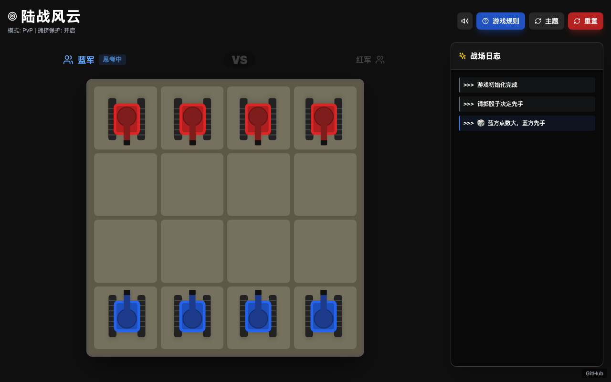

# 坦克战术 (Tank Tactics)

基于 React + Vite 的回合制战术对战游戏，支持双人对战 (PvP) 和人机对战 (PvE)。



## 在线体验

**GitHub Pages**: [https://holynova.github.io/tank-tactics-game/](https://holynova.github.io/tank-tactics-game/)

扫码访问：


## 游戏特色

- **陆战风云 / 怒海争锋** 双主题切换
- **集火机制**：2v1 夹击消灭敌方单位
- **保护系统**：友军保护与拥挤保护
- **音效系统**：引擎、炮火、爆炸音效
- **精美动画**：旋转、移动、射击、爆炸全程动画
- **AI 对战**：三档难度（简单 / 中等 / 困难）

## 技术栈

React 18 · Vite · Tailwind CSS · Lucide Icons · pnpm

## 本地开发

```bash
pnpm install
pnpm dev
```

## 项目地址

GitHub: [https://github.com/holynova/tank-tactics-game](https://github.com/holynova/tank-tactics-game)

## License

MIT
