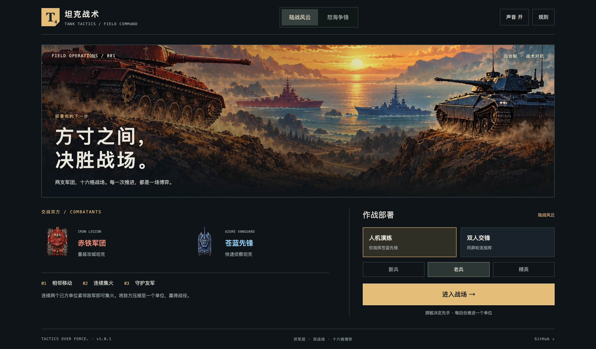

# 坦克战术 · 赤铁与苍蓝 / Tank Tactics

中文：4×4 回合制陆海战术游戏，支持同屏双人和人机演练。两军团使用独立像素造型，包含 ChatGPT 绘制的地形、首页与胜负插画，以及履带、扬尘、舰船尾流、炮弹光影和十五种原创音效。连续集火，将敌方压缩至一个单位即可获胜；人机模式由玩家指挥蓝方。

English: A 4×4 turn-based land and sea tactics game with local PvP and AI opponents. Distinct factions, ChatGPT-generated raster art, animated tracks and wakes, artillery lighting, illustrated results, and fifteen original sound samples. Form consecutive firing lines to reduce the enemy to one unit. The player commands blue in AI mode.



## 在线体验 / Live Demo

- [Cloudflare Demo](https://tank-tactics-game.xiaosang.cc/)
- [GitHub Repo](https://github.com/holynova/tank-tactics-game)


## 本地运行 / Run locally

Node.js + pnpm:

```bash
pnpm install --frozen-lockfile
pnpm dev
```

Open the URL printed by Vite, at root path `/`.

```bash
pnpm typecheck
pnpm lint
pnpm test
pnpm build
pnpm preview
```

## 发布 / Deploy

```bash
pnpm run deploy:check
pnpm run deploy
```

Cloudflare Workers Static Assets · `tank-tactics-game.xiaosang.cc`.
源码与部署配置均在 `main`，从同一提交在本地手动发布。GitHub Pages 保留作回退；现有工作流以 `GITHUB_PAGES=1` 构建。

Source and Wrangler configuration share `main`. Deploy manually from the same commit. Existing GitHub Pages remains a fallback and uses `GITHUB_PAGES=1`.

## 资源 / Assets

`public/art/` and `public/audio/` contain runtime assets. `source-art/` preserves original PNGs and prompts; `source-audio/` preserves sound samples. [升级与验证记录 / Upgrade notes](docs/UPGRADE_NOTES.md) describe animation, rendering fixes, and QA. Optional asset preparation uses Python + Pillow and FFmpeg via `scripts/prepare_art.py` and `scripts/build_audio.py`.

Version is read from `package.json` and displayed in the footer. The existing unified Umami tracker is reused once for the production and fallback domains.
